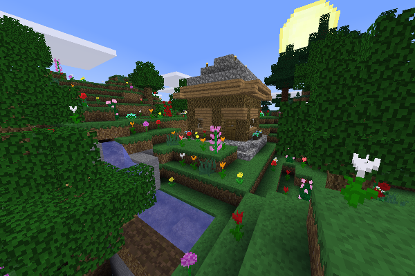

------------------------------
REFI_Textures:
------------------------------

A 16px texture pack.  
These textures were created from scratch in an attempt to recapture the aesthetic of Minecraft, while improving upon visibility.  
This version is fully usable in Minetest Game, Mineclonia, MineClone2 up to v0.80, and more.  

<br/>

**Project Status:** Active - Further updates are in development.
<br/>


------------------------------

The 'textures' sub-folder now holds the supported textures for Minetest Game, MineClone2, and Mineclonia 


**Also included in this package is the following:**
*	Partial support for the game, SkyFactory.  
    * bonemeal  
    * elepower  
    * farming(_redo)  
    * fromscratch  
    * melterns  
    * protector  
*	Partial support for the mods used by mcimport in converted worlds.  
    * basic_materials  
    * bedrock  
    * crops  
    * flowerpot  
    * hardenedclay  
    * lapis  
    * mesecons  
    * nether  
    * quartz  
    * signs_lib  
    * vines  
    * xdecor
*	Some templates for character skin creation.
*	Some Minetest menu textures.
*	Support for a few Minetest Game mods.  
    * 3d_armor  
    * bakedclay  
    * bees  
    * caverealms  
    * digilines  
    * elevators  
    * hbhunger  
    * leads 
    * mobs_redo  
    * new_fireworks  
    * pipeworks  
    * shop  
    * simple_robots  
    * stamina  
    * thirsty
*	Miscellaneous Goodies.
*	Alternate textures moved to their own folder.

=================================

PNG Optimization Settings:  
```find -type f -name "*.png" -exec optipng -o7 -nx -strip all {} \;```

=================================

LICENSE:

    * Author: MysticTempest
    * Source: https://github.com/MysticTempest/REFI_Textures
    * License: CC BY-SA 4.0 - [CC BY-SA 4.0](https://creativecommons.org/licenses/by-sa/4.0/)

=================================

Contributing:  
In order to maintain the integrity of the pack, and ensure a consistent art style; PRs are not being accepted.
For any issues or concerns; please open an issue instead.

=================================

Preview:

