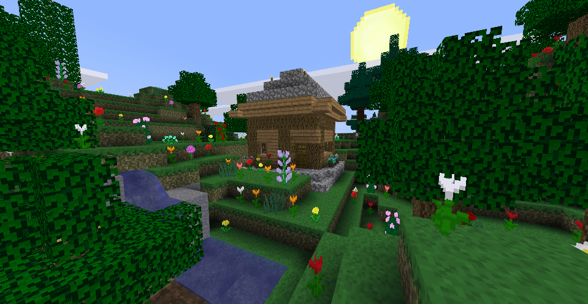

------------------------------
REFI_Textures:
------------------------------

Textures created from scratch in an attempt to recapture the aesthetic of Minecraft.
This version is usable in both Minetest Game v5.x and MineClone2.

------------------------------

The 'textures' sub-folder now holds the supported textures for Minetest Game, and MineClone2.
It may be sub-divided further in the future, but for now you can easily move the textures back to the parent folder if you require support for Minetest 0.4.17.

**Also included in this package is the following:**
*	Partial support for the game, SkyFactory. 
*	Partial support for the mods used by mcimport in converted worlds.
*	Some templates for character skin creation.
*	Support for a few Minetest Game mods(currently: 3d_armor, bees, caverealms, hbhunger, mobs_redo, shop, simple_robots, stamina, thirsty)

=================================

LICENSE:

    * Author: MysticTempest
    * Source: https://github.com/MysticTempest/REFI_Textures
    * License: CC BY-SA 4.0 - [CC BY-SA 4.0](https://creativecommons.org/licenses/by-sa/4.0/)

=================================

Preview:

